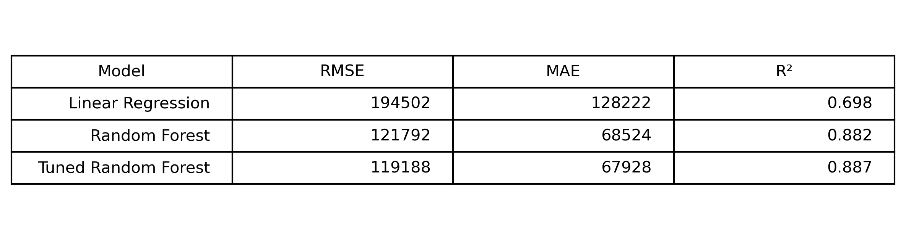
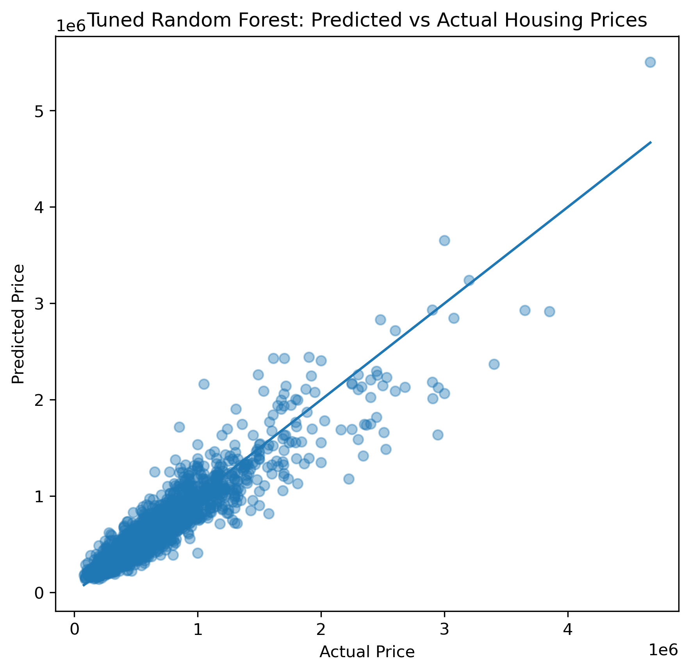
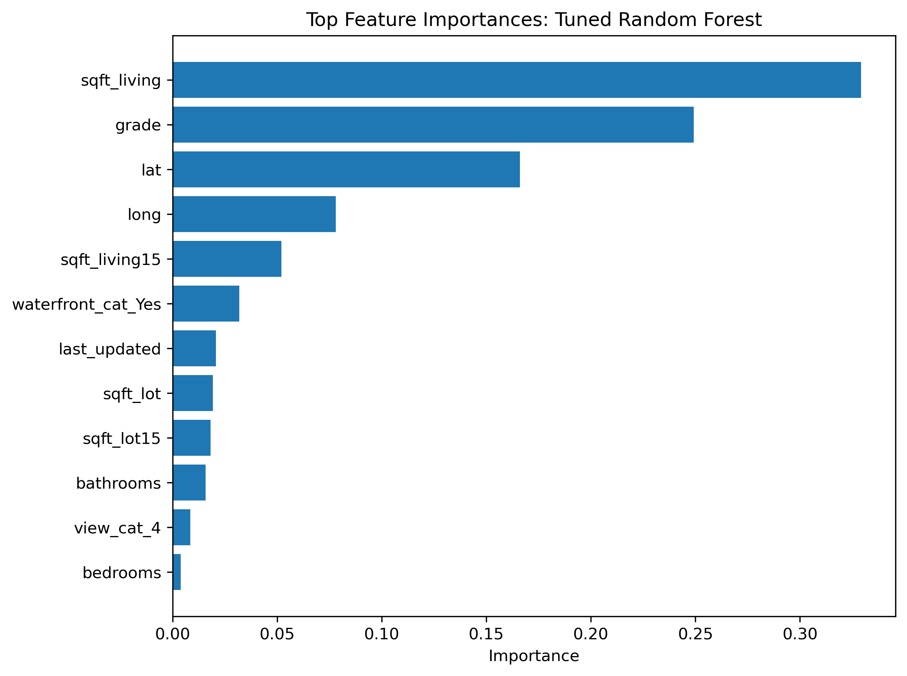

# king-county-housing-ml-project
Machine learning project for housing price prediction (regression) and condition classification using Python, pandas, scikit-learn, Linear Regression, Logistic Regression, Random Forest, and GridSearchCV, with feature engineering, data preprocessing, cross-validation,  and model evaluation (RMSE, MAE, R², ROC-AUC).

## Impact & Applications

This project shows how machine learning can be used to predict housing prices using real-world data. The tuned Random Forest model outperformed linear regression, indicating that nonlinear relationships and feature interactions are important in housing price prediction. **Feature importance analysis showed that living area, construction quality (grade), location, and waterfront access were the strongest drivers of price. These results illustrate how data-driven models can support pricing decisions, property valuation, and real estate investment analysis.**

## Model Interpretation and Final Recommendation

After evaluating several models, the tuned Random Forest model produced the strongest predictive performance.

The comparison between models shows:

| Model | Strengths |
|------|------|
| Linear Regression | Highly interpretable baseline model |
| Random Forest | Captures nonlinear relationships |
| Tuned Random Forest | Best predictive performance after hyperparameter optimization |

  

While linear regression provides useful interpretability, the Random Forest model is able to capture complex interactions between housing characteristics.

  

For practical price prediction tasks, the **tuned Random Forest model is the preferred model**.

### Interpreting Feature Importance

The Random Forest feature importance analysis highlights the variables that most influence housing prices.

  

The most important predictors include:

- **sqft_living** — living area strongly affects price
- **grade** — construction quality significantly influences property value
- **location variables (latitude / longitude)** — geographic location strongly affects housing markets
- **waterfront access** — waterfront homes command higher prices
- **neighboring home characteristics** — surrounding properties influence valuation

## Limitations

This analysis has several limitations:

- The dataset represents only one year of housing sales.
- Some potentially important features such as school districts or neighborhood amenities are missing.

## Modeling

- Built an end-to-end housing price prediction pipeline on King County data (20k+ records), using Linear Regression and Random Forest with cross-validated hyperparameter tuning (GridSearchCV).

- Improved predictive performance over baseline linear model by implementing a tuned Random Forest (RMSE ↓, R² ↑), demonstrating gains from nonlinear modeling.

- Engineered features (e.g., last_updated, categorical encodings) and removed redundant variables to improve model stability and interpretability.
- Developed reproducible ML pipelines (ColumnTransformer + Pipeline) with imputation, scaling, and one-hot encoding; evaluated models on a held-out test set.
- Produced model diagnostics and visualizations (predicted vs. actual, residuals, ROC/AUC, feature importance) to communicate key drivers of price.

